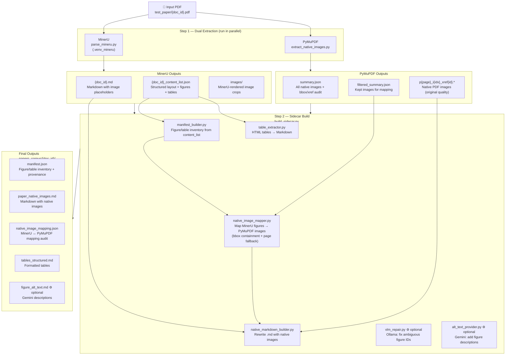

# PDF → Text + Image Extraction Pipeline

> Personal modification of Class 2 Task 1 & 2.
> Instead of Tesseract OCR, this pipeline uses **MinerU** (layout-aware PDF parser)
> and **PyMuPDF** (native image extractor) to produce higher-quality structured outputs
> suited for scientific paper processing.

---

## Overview

The pipeline takes raw PDFs and produces:
- Structured text in **Markdown** with figure/table placeholders
- **Native PDF images** extracted at original resolution (not screen captures)
- A **manifest** linking each figure to its caption, page, and image file

---

## Architecture Diagram



---

## Step-by-Step Flow

### Step 1a — MinerU Text Extraction

MinerU is a layout-aware PDF parser that understands multi-column academic layouts, formulas, and tables.

| Input | Output |
|-------|--------|
| `{doc_id}.pdf` | `{doc_id}.md` — full paper as Markdown with `` placeholders |
| | `{doc_id}_content_list.json` — structured list of text blocks, figures, tables with bboxes |
| | `images/` — MinerU-rendered figure crops (used as fallback) |

```bash
# Run MinerU on one paper
.venv_mineru/bin/python parse_mineru.py chang-2023 test_paper/chang-2023.pdf
```

### Step 1b — PyMuPDF Native Image Extraction

PyMuPDF reads the raw PDF binary and extracts images at their original stored resolution — higher quality than rendering to screen.

| Input | Output |
|-------|--------|
| `{doc_id}.pdf` | `p{page}_i{idx}_xref{id}.jpeg/.png` — native PDF images |
| | `summary.json` — xref, page, pixel size, display bbox for every image |
| | `filtered_summary.json` — kept images after filtering out icons/badges |

```bash
# Run native image extraction
conda run -n seismo python3 processors/extract_native_images.py chang-2023
```

**Why native images?**
Native PDF images preserve figure quality better than MinerU's rendered crops. A native JPEG extracted directly from the PDF binary is the same file the PDF author embedded — no recompression or rendering artifacts.

### Step 2 — Sidecar Build

The sidecar pipeline integrates MinerU text with PyMuPDF images.

```
manifest_builder   → build figure/table inventory from content_list.json
native_image_mapper → match each manifest figure to a PyMuPDF native image
                      using bbox containment (primary) or page order (fallback)
table_extractor    → convert MinerU HTML tables to Markdown
native_markdown_builder → rewrite paper.md: replace MinerU placeholders with
                          native image paths where mapping confidence is high/medium
vlm_repair         → (optional) Ollama: fix garbled or missing figure IDs
alt_text_provider  → (optional) Gemini: add human-readable figure descriptions
```

```bash
# Full pipeline (MinerU + sidecar)
conda run -n seismo python3 batch_process.py chang-2023

# Model-free (deterministic only, faster)
conda run -n seismo python3 batch_process.py --skip-vlm --skip-alt-text chang-2023
```

---

## Comparison: Original Homework vs. Personal Approach

| | Homework (Tesseract) | Personal (MinerU + PyMuPDF) |
|---|---|---|
| **Text extraction** | OCR on page screenshots | Layout-aware PDF parsing |
| **Image extraction** | Screenshot crop | Native PDF binary extraction |
| **Table handling** | OCR (error-prone) | Structured HTML from PDF parser |
| **Formula handling** | OCR (unreliable) | MinerU LaTeX-aware parsing |
| **Output format** | Plain `.txt` | Structured `.md` + `.json` manifest |
| **Quality** | Moderate (OCR errors) | High (no OCR for text-based PDFs) |
| **Use case** | General scanned documents | Academic papers (text-based PDFs) |

> **Note:** Tesseract OCR is best suited for scanned/image-only PDFs. For text-based academic PDFs,
> parsing the PDF structure directly produces far cleaner results without OCR errors.

---

## Sample Output (chang-2023)

```
sample/chang-2023/
├── chang-2023.md                  ← full paper markdown (MinerU)
├── chang-2023_content_list.json   ← structured blocks with bboxes
└── native_images/
    ├── p001_i001_xref656.jpeg     ← Figure on page 1 (native quality)
    ├── p002_i001_xref7.jpeg
    ├── p004_i001_xref51.jpeg
    └── ...                        ← 17 total native images
```

---

## Environment Setup

```bash
# MinerU extraction (dedicated venv)
python3 -m venv .venv_mineru
.venv_mineru/bin/pip install magic-pdf

# Sidecar pipeline (conda env with PyMuPDF)
conda activate seismo
pip install pymupdf

# Optional enrichment
pip install google-generativeai   # Gemini alt-text
# ollama pull llava               # VLM repair
```
